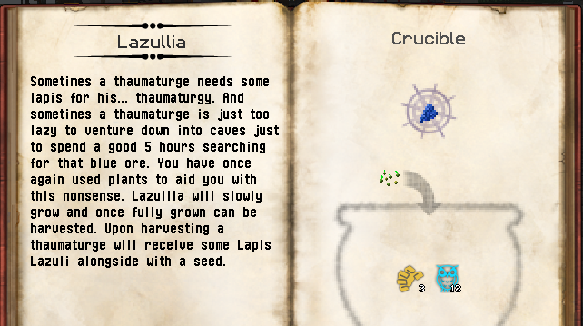
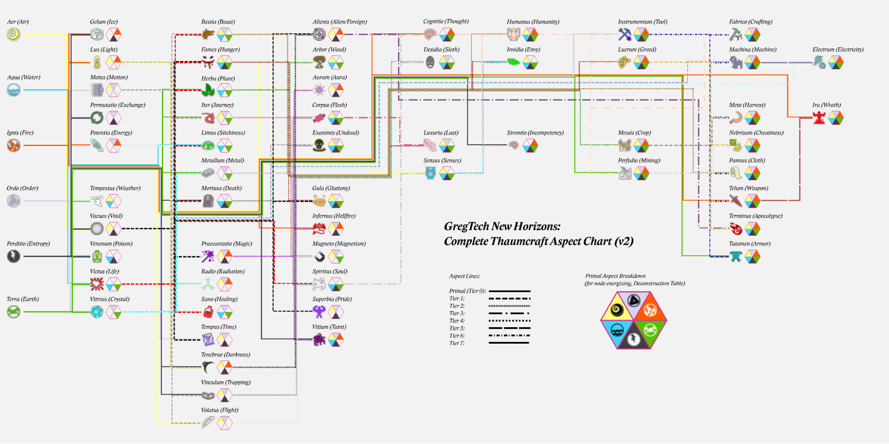

# Early Game (Until LV)

### When you spawn, you will die. There are no dirt blocks in the entire world. Fortunately, your death will spawn a gravestone with dirt under it.

# Welcome to the **Dirt Age**.

Continue dying until all spawn randomization locations (roughly a 22x22 square) have graves/dirt on them.

Ok, now you can walk around without dying instantly on spawning! You have two tasks now:

1. Remove all graves. These will spawn skeletons (including infernals) during the night, which will obliterate you at this stage. They do this regardless of player distance, unlike normal mob spawning.
2. Graves spawn at `y=4`, which means you have just enough space to create tunnels under the platform to farm dirt. You only need 1 block of space and shift walking to farm a 3 wide swath of dirt.

Once you’ve completed these two tasks, spawn proof the main island with draconic place. For this you can use any item, like raw human flesh or heads (you’ll have plenty by this point from farming graves and being destroyed by infernals).

Your next goal is to build a manual skeleton grinder using graves. You want to obtain two things - a **splash potion of weakness**, and a **non-enchanted golden apple**. These will be used to cure a zombie villager, who will give you your sapling trade. Unfortunately, these are from player kills only, so we need to do some careful design.

The first important fact is that draconic place items have obsidian-level blast resistance. This will be handy when building grinder setups.

For a skeleton grinder setup, this is the design we used, allowing us to hit the skeletons from below:

Of course, we don’t have stone slabs in world and using dirt is annoying due to the cost to obtain, so this is how ours looked in world using draconic place:

Eventually you will acquire your splash weakness potion and golden apple. Build a separate spawning area so you can pull out a zombie villager, then use the items on him to convert him back into a villager. (Make sure the sky is blocked so he does not burn during the day!)

If you don’t get the villager you want (sapling trade), this is ok. Use the questbook to get a cookie and craft a Mystery Arrow. Place a dispenser into the villager chamber and take a backup. Now add your Mystery Arrow and activate the dispenser using a redstone torch (redstone and sticks are a drop from witches, and torches are a drop from a certain type of creeper if you can’t get sticks). Restore your backup until you get the type of villager you want (a farmer with a vanilla sapling trade). Congratulations, you’ve entered the **Wood Age!**

# The Wood Age

Your goal in the Wood Age is to obtain XP bucket crafting. This will give you access to a wide variety of metal dusts and important resources (eg sulfur dust). There are two methods:

### The shorter / modern method (seared tank):

1. Obtain apothecary villager trade for clay and craft seared tank (make sure `GenerateApothecaries=true` in `witchery.cfg`)
2. Build XP drain
3. Bucket XP from the filled XP drain

The longer / older method (RC tank):

1. Build a performant general mob grinder for zombie iron ingot drops, which you will use for RC tank and cropsticks.
2. Build an XP drain and an RC tank to hold the XP (this requires a lot of iron)
3. Crossbreed IC2 crops for the bronze you need for the RC tank valve (copper + tin oreberry)

The shorter / modern method is pretty straightforward, so I will not cover it here. To save a considerable amount of space (10 pages) in this doc, I moved the older / longer method to a separate doc, which can be found at [Wood Age Mob Farm Design](mob_farm_design.md).

When trying to obtain XP oreberries, we recommend going on the red mushroom -> reed -> stickreed -> oreberries route, then breeding the oreberries from there.

# Using Stone Age Thaum to reach LV from XP Buckets

Now you can make a BBF, so do that 🙂

To start making LV circuits, you need vacuum tubes. To do this you will need a ball mold, which you can only make in a TC smeltery. **So how do you get lava?**

There is a bee drop - Simmering Comb (available as a low likelihood villager trade) - that gives lava when centrifuged. But you’re pre-LV and therefore have no LV centrifuge. Fortunately, we have a savior in a meme item:

Yes - the **Hobbyist Steam Engine** (HSE) is finally useful! We can use a **Forestry Centrifuge** (as it also does not require LV circuits) and RF from the HSE to process our simmering combs. But to craft the HSE, you need lapis lazuli plates. Normally you would look to IC2 crops to solve this problem, but the IC2 Lazulia crop requires a lapis block or lapis ore, so we’re back where we started.

Fortunately, this problem is solvable - there is a magical crop that drops lapis lazuli! But we still have to make it...

# Thaumcraft Research

Thaumcraft progression at this point is very awkward, so we’ll pull some tricks from [Stone Age Thaumcraft](https://docs.google.com/document/d/1VF9HJPsaJasY_V_3OeJOX5RIRzGx5Xjfr-iBzzjfZGU/edit). In particular, we can obtain a profane wand from a heretic villager, and we can get a bookshelf trade from a librarian villager. This allows us to obtain a **Thaumonomicon**. We can also obtain **Scribing Tools**:

1. Feathers (drops from chickens and some sniper skeleton mobs)
2. Ink sacs (squid spawns - should happen quite fast in a void world)
3. Glass bottle (drops from witches)
4. Rubber round (rubber is craftable from XP buckets and steam machines)

With these two tools and paper from IC2 sugar cane, we can make researches. For Thaumcraft lazullia, you need:

1. [Thaumic Bases] Metalleat
2. [Thaumic Bases] Basic Plants

But wait… how do you do the researches?? You have only a few primals when starting out in your thaumcraft journey, and you don’t have a thaumometer yet. Obtaining a thaumometer requires a diamond lens, which you can’t make until LV post lathe and cutting machine. But we haven’t even made LV circuits yet. Our answer is abusing an obscure mechanic: bonus points.

Ever noticed these annoying shimmers in the top left of the aspects in the research table? Those are actually free research points! Every 30 seconds, each research table in the world will randomly select a block in a roughly 8x8x8 radius and check if it is in the whitelisted bonus points table. Most whitelisted blocks give what you would expect - ignis for lava, aqua for water, terra for cobblestone, etc. If you happen to have a bookcase in radius, any point can be added, even compound points (eg instrumentum).

The bonus point is only spent when you are at 0 stored points for that aspect, and there is only 1 bonus point. This sounds useless, until you realize:

1. Researches can be moved between tables while in progress
2. The bonus points are stored **per table**, which means you can build up one of every point per table (assuming the tables are chunkloaded long enough).

Using this, you are able to complete early researches. To unlock new points that you would normally unlock using the thaumometer, just drag the primals onto each other to build the compound aspects. You can follow this chart, which has most aspects (except for the new ones Alastor has added):

You can also try using balanced shard transmutation to get shards later if you’re missing any, or just breed and trade with enough villagers that you get every shard. If you need any help with essentia for alchemy, [check out my spreadsheet on it](https://docs.google.com/spreadsheets/d/1Llvu91Vmn4RcCE__lKV8p_MIR9tiaV2URGbkombvlkE/edit#gid=0). When you are making arcane workbench crafts, you need to be careful about how you use the profane wands to avoid warp. There is a guide on the wiki for this: https://gtnh.miraheze.org/wiki/Profane_Wand

# Smeltery Batching

Once you get your lava and your TC smeltery built - be careful with what you put in! You won’t get infinite trades with the beekeeper villager at this point in the game - some trades require spending princesses or drones, which you really don’t want at this stage.

Fortunately, preserving lava in the TC smeltery is quite simple - it just uses a constant amount of lava when on, regardless of size or which items are currently being burnt. So you just need to make a big smeltery and do a big batch. Compressing metals or using large plates helps you get multiple items done in a single operation. You can see our batch:

That is:

1. 1 copper block
2. 5 bronze blocks
3. 10 steel blocks
4. 10 aluminium dust
5. 32 glass dust
6. 1 block + 7 alumite ingots
7. 16 large stone plates

Congrats! Once you process this batch, you’re all ready to get a ball mold and enter LV.